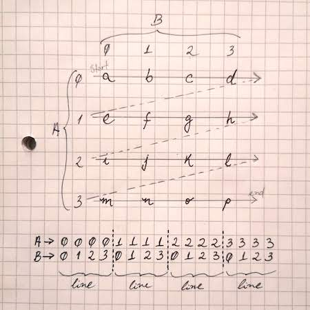

Word Hunter
===========

This is a Word Hunter application.

Install
-------

To install, use:

```
$ pip install .
```

Run
---

To run, execute:

```
$ wordhunter --wordlist selftests/data/words.txt --dimension 4
INFO Matrix 4x4:
INFO   ['g', 'c', 'r', 'c']
INFO   ['x', 'q', 'u', 'v']
INFO   ['e', 'f', 'd', 'g']
INFO   ['w', 'n', 'x', 'p']
INFO Wordlist number of words: 62799
INFO The hunter has found 2 words:
INFO ['we', 'ex']
```

Where:
 - The `--wordlist` is a file containing one valid word per line.
 - The `--dimension` is the size of the matrix side. E.g. a dimension `4`
 will generate a 4x4 matrix.

For additional information, run `wordhunter --help`

Test
----

You can run the selftests with:

```
$ python selftests/run.py
```

Performance
-----------

The Word Hunter was optimized for performance. To do that, some
design decisions were made:

- The wordlist file is retrieved line by line, avoiding excessive
  memory consumption.
- The wordlist file content is parsed into a Python set for
  fast lookup.
- The hunter helpers are matching the words in both normal and
  reversed order to avoid extra loop for the reversed words.

All together, the entire execution for a default 15x15 matrix was kept
under half second:

```
$ time wordhunter --wordlist selftests/data/words.txt --dimension 15
INFO Matrix 15x15:
INFO   ['k', 'i', 'c', 't', 'a', 'n', 'j', 'x', 'w', 'w', 'y', 't', 'm', 'u', 't']
INFO   ['a', 'i', 'v', 'c', 'd', 't', 'b', 'e', 'd', 'i', 'r', 'b', 'a', 'h', 'o']
INFO   ['o', 'q', 'r', 'v', 'b', 'i', 'd', 'm', 'c', 'r', 'm', 'e', 'z', 'q', 'l']
INFO   ['c', 'a', 'o', 'p', 'q', 's', 'u', 'r', 'z', 'v', 'u', 'u', 'o', 'q', 't']
INFO   ['h', 'e', 'z', 'x', 'k', 'p', 'y', 'v', 'c', 'x', 'f', 'y', 'y', 'y', 'q']
INFO   ['s', 'o', 'j', 'j', 'g', 'x', 'j', 'r', 'h', 'y', 'z', 'e', 'u', 't', 's']
INFO   ['d', 'v', 'v', 'z', 'k', 'n', 'h', 'd', 'i', 'l', 'a', 'i', 'y', 'j', 'a']
INFO   ['n', 'w', 'o', 'r', 'a', 'e', 'u', 'f', 't', 'k', 'e', 'x', 'k', 'p', 'd']
INFO   ['o', 'i', 'b', 'a', 'a', 'j', 'k', 'd', 'x', 'a', 'h', 'm', 'u', 'x', 'r']
INFO   ['d', 'z', 'v', 's', 's', 'm', 'i', 'j', 'i', 'r', 'd', 'd', 'x', 'z', 'v']
INFO   ['e', 'g', 'h', 'o', 'p', 'x', 'v', 'w', 'b', 'a', 'n', 'm', 'r', 't', 'e']
INFO   ['w', 'p', 'p', 's', 'd', 'p', 'f', 'w', 'w', 'h', 'm', 'j', 'h', 'w', 'i']
INFO   ['h', 't', 'o', 'l', 'h', 'u', 'd', 'r', 'm', 'w', 'h', 'j', 'r', 'w', 'j']
INFO   ['m', 'v', 'z', 'j', 'k', 'f', 'i', 'j', 't', 'f', 'z', 'q', 'w', 'a', 'n']
INFO   ['s', 'd', 'h', 'z', 'l', 'u', 'g', 'j', 'k', 'y', 'g', 'r', 't', 'f', 'h']
INFO Wordlist number of words: 62799
INFO The hunter has found 115 words:
INFO ['opt', 'ha', 'lid', 'or', 'ex', 'nod', 'wed', 'ow', 'hop', 'ye', 'as', 'fey', 'duh', 'hit', 'es', 'weds', 'chi', 'fa', 're', 'to', 'id', 'ks', 'rid', 'sos', 'asp', 'by', 'oak', 'wan', 'ho', 'lug', 'em', 'sh', 'nab', 'do', 'cry', 'ash', 'ram', 'deb', 'up', 'yum', 'gnu', 'wiz', 'if', 'aid', 'wad', 'ad', 'an', 'me', 'pa', 'yo', 'ox', 'ban', 'in', 'dig', 'lo', 'maid', 'so', 'mar', 'nu', 'mu', 'rhea', 'row', 'bed', 'um', 'via', 'ah', 'us', 'lot', 'oh', 'loth', 'is', 'eh', 'it', 'chit', 'bah', 'we', 'dun', 'no', 'hi', 'debt', 'ms', 'ls', 'ear', 'ti', 'ode', 'arc', 'am', 'ma', 'be', 'own', 'ax', 'sad', 'yea', 'rheas', 'tad', 'ride', 'dew', 'ts', 'bride', 'at', 'bid', 'sop', 'mi', 'sit', 'ay', 'on', 'uh', 'vs', 'he', 'tan', 'baa', 'dung', 'node', 'la', 'don']

real	0m0.237s
user	0m0.201s
sys     0m0.034s
```

Algorithms
----------

This application will retrieve the sequence of characters given the search direction. A word hunt in a grid
has to consider four cases (and their reversed directions):

Horizontal:



Vertical:


Diagonal, from the top left to the bottom right:


Diagonal, from the top right to the bottom left:


To expose the elements coordinates and the matches per search algorithm basis, use the `--debug` option:

```
$ wordhunter --wordlist selftests/data/words.txt --dimension 4 --debug
INFO Matrix 4x4:
INFO   ['z', 'z', 'r', 's']
INFO   ['j', 'g', 'f', 'a']
INFO   ['c', 'q', 's', 'p']
INFO   ['n', 'r', 'h', 'i']
INFO Wordlist number of words: 62799
DEBUG Horizontal search
DEBUG   Rows:
DEBUG   --> [(0, 0), (0, 1), (0, 2), (0, 3)]
DEBUG   --> [(1, 0), (1, 1), (1, 2), (1, 3)]
DEBUG   --> [(2, 0), (2, 1), (2, 2), (2, 3)]
DEBUG   --> [(3, 0), (3, 1), (3, 2), (3, 3)]
DEBUG   Matches:
DEBUG   --> ['rs', 'fa', 'hi']
DEBUG Vertical search
DEBUG   Columns:
DEBUG   --> [(0, 0), (1, 0), (2, 0), (3, 0)]
DEBUG   --> [(0, 1), (1, 1), (2, 1), (3, 1)]
DEBUG   --> [(0, 2), (1, 2), (2, 2), (3, 2)]
DEBUG   --> [(0, 3), (1, 3), (2, 3), (3, 3)]
DEBUG   Matches:
DEBUG   --> ['sh', 'as', 'sap', 'pas', 'pa', 'pi']
DEBUG Diagonal search, from top right to bottom left
DEBUG   Diagonals:
DEBUG   --> [(0, 3)]
DEBUG   --> [(0, 2), (1, 3)]
DEBUG   --> [(0, 1), (1, 2), (2, 3)]
DEBUG   --> [(0, 0), (1, 1), (2, 2), (3, 3)]
DEBUG   --> [(1, 0), (2, 1), (3, 2)]
DEBUG   --> [(2, 0), (3, 1)]
DEBUG   --> [(3, 0)]
DEBUG   Matches:
DEBUG   --> ['gs', 'is']
DEBUG Diagonal search, from top left to bottom right
DEBUG   Diagonals:
DEBUG   --> [(0, 0)]
DEBUG   --> [(0, 1), (1, 0)]
DEBUG   --> [(0, 2), (1, 1), (2, 0)]
DEBUG   --> [(0, 3), (1, 2), (2, 1), (3, 0)]
DEBUG   --> [(1, 3), (2, 2), (3, 1)]
DEBUG   --> [(2, 3), (3, 2)]
DEBUG   --> [(3, 3)]
DEBUG   Matches:
DEBUG   --> ['as', 'rs']
INFO The hunter has found 11 words:
INFO ['rs', 'sh', 'hi', 'fa', 'gs', 'is', 'pa', 'pas', 'pi', 'sap', 'as']
```

Notice that the final list of words will show only once the words found in multiple directions.
